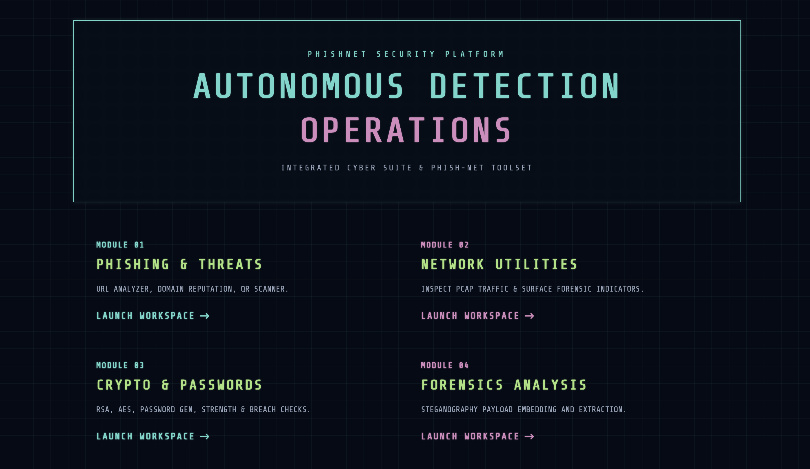
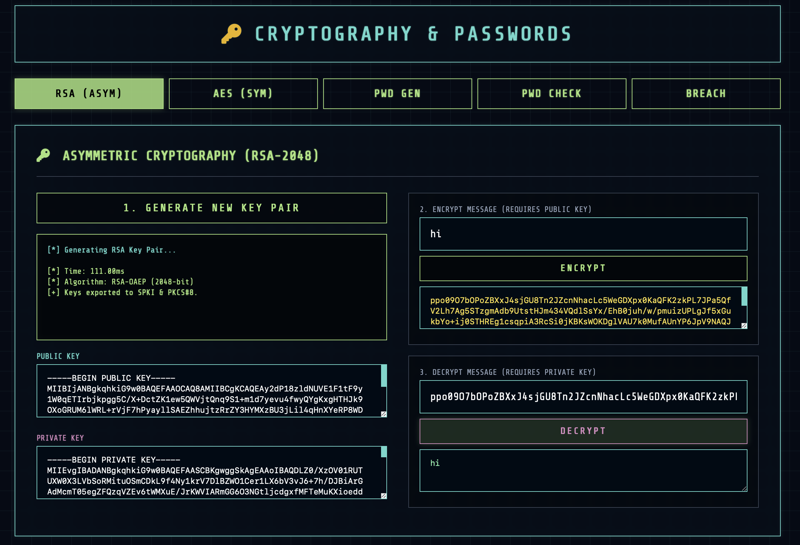
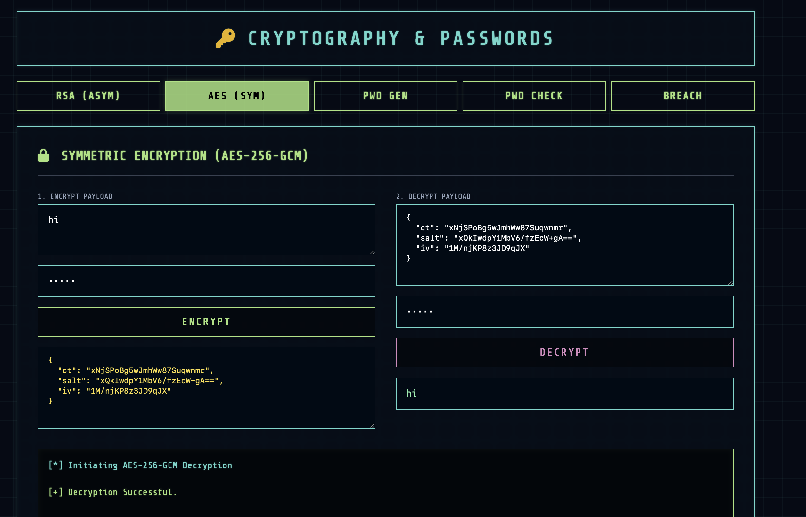
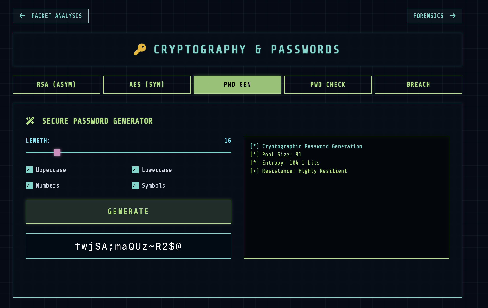
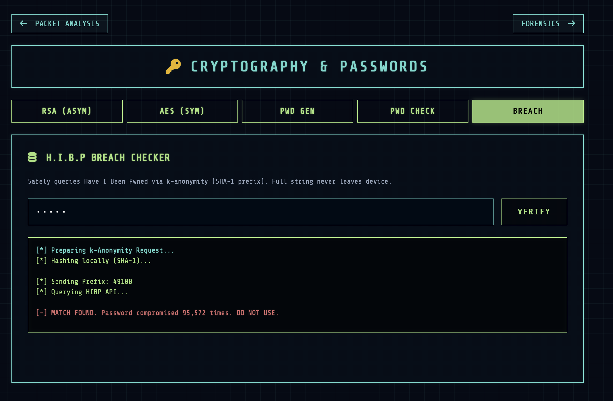

🛡️ Cyber Suite | Autonomous Detection Operations

Cyber Suite is a comprehensive, browser-native cybersecurity and forensic toolkit. Designed with a sleek, responsive retro-cyberpunk aesthetic, it provides advanced network analysis, cryptographic functions, and password security tools that run entirely on the client side.

🚀 Features

The platform is divided into three core operational modules:

🌐 Module 01: Network & Web Utilities

URL Analyzer: Performs static and heuristic analysis on suspicious links, simulating threat intelligence feed queries to generate a threat score.

Domain Reputation: Evaluates domains/IPs against common threat signatures, providing a detailed mock OSINT footprint (WHOIS, DNS, Reputation).

QR Code Scanner: Safely uploads and decodes suspicious QR code images without executing the payload, utilizing the jsQR engine.

PCAP Analyzer: Simulates deep packet inspection on uploaded .pcap/.pcapng files, generating detailed Wireshark-style forensic summaries.

🔐 Module 02: Cryptography

Asymmetric Cryptography (RSA): Generate 2048-bit RSA key pairs, and encrypt/decrypt messages natively using the browser's Web Crypto API. Keys are exported in standard SPKI and PKCS#8 formats.

Symmetric Encryption (AES-GCM): Securely encrypt and decrypt payloads using AES-256-GCM. Includes automatic PBKDF2 key derivation, Salt, and IV generation.

LSB Steganography: Hide (inject) and reveal (extract) secret text payloads within the Least Significant Bits of the RGB channels of PNG images.

🔑 Module 03: Password Toolkit

Secure Password Generator: Generate highly secure, customized passwords locally using window.crypto.getRandomValues() (CSPRNG).

Strength Checker: Calculates the exact Shannon Entropy and estimated brute-force resistance time of a given password.

Breach Checker: Queries the Have I Been Pwned database to see if a password has been compromised. Privacy First: Uses the k-Anonymity model—only the first 5 characters of a local SHA-1 hash are sent to the API. Your full password never leaves your device.

🛠️ Technologies Used

Frontend Framework: HTML5, Vanilla JavaScript, Tailwind CSS (via CDN).

Cryptography: Native browser Web Crypto API (No external servers required).

QR Decoding: jsQR (Client-side QR code reading).

Icons & Typography: FontAwesome 6, Google Fonts (Inter, Share Tech Mono).

🔒 Security & Privacy Notice

This application is a 100% Client-Side Single Page Application (SPA). * Cryptographic keys (RSA/AES) are generated directly in your browser's memory.

Data encrypted or decrypted via this tool never touches an external server.

The Password Breach tool hashes your password locally and uses the k-Anonymity privacy model, ensuring your actual password is never transmitted across the network.

💻 Getting Started

Because Cyber Suite is a zero-dependency, static frontend application, installation is instantaneous.

Clone the repository:

git clone [https://github.com/iamGirishWadhwani100/Real-Time-AI-ML-Based-Phishing-Detection-and-Prevention-System.git)

Navigate to the directory:

cd cyber-suite

Run the application:
Simply double-click the index.html file to open it in any modern web browser (Chrome, Firefox, Safari, Edge). No local server (like Node or Python) is required!

📸 Screenshots

(Note: Add your actual screenshot image files to an /assets/ folder in your repo and update these links)

Click to view screenshots

Dashboard & UI

Cryptographic Operations

Password Toolkit

🤝 Contributing

Contributions, issues, and feature requests are welcome!
Feel free to check the issues page if you want to contribute.

📄 License

Distributed under the MIT License. See LICENSE for more information.
